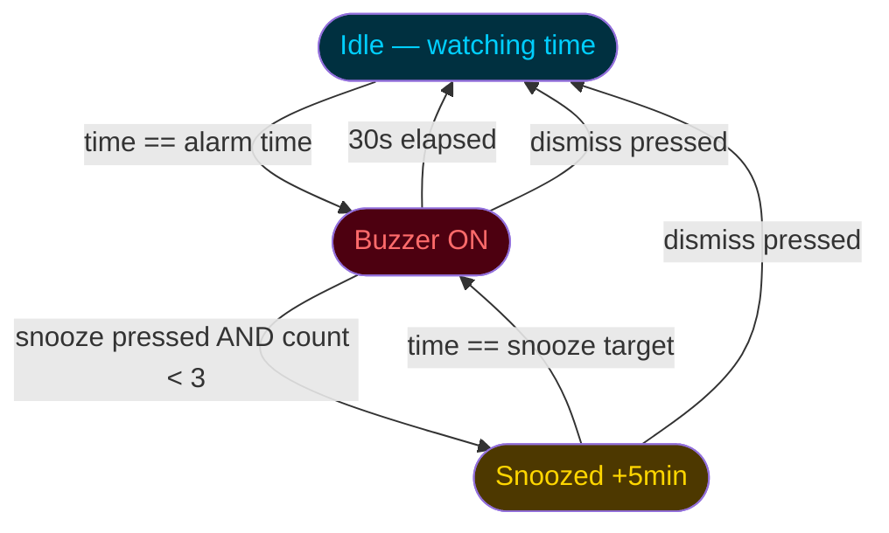

# VLSI-Based Digital Clock with Alarm Functionality


A fully verified **VLSI Digital Clock with Alarm** implemented in **Verilog RTL** — featuring BCD HH:MM:SS timekeeping, 12/24hr mode, alarm with snooze, and a live **React web simulator** deployed on Render.

⏰ **[Live Demo →](https://vlsi-digital-clock-alarm.onrender.com)**
⭐ **[GitHub →](https://github.com/Neha-Joshi05/VLSI-Digital-Clock-Alarm)**

---

## What is this project?

A digital clock is one of the most fundamental sequential VLSI designs — testing mastery of BCD counters, clock division, comparators, and FSM-based control. This implementation goes beyond timekeeping to include a full alarm subsystem with snooze logic and dual time-format support.

---

## Features
```
- BCD HH:MM:SS counter — 24-hour rollover with correct carry chains
- 12/24-hour mode switching with AM/PM flag
- Manual time-set mode — adjust hours and minutes via buttons
- Alarm comparator — hour/minute match triggers buzzer
- Snooze logic — up to 3 snoozes, 5-minute intervals
- Auto-dismiss — buzzer times out after 30 seconds
- Dismiss button — instant alarm cancel and snooze reset
- 7-segment BCD decoder — 6 digits, gfedcba active-high encoding
- Single clock domain — clock-enable architecture, 1Hz tick from 50MHz
- Self-checking testbench — 7 test phases covering all functionality
- React web simulator — mirrors exact RTL timing and logic
```
---

## Architecture

```
clk_50m ──► clk_en (1Hz) ──► time_counter ──► hrs, mins, secs
                                   │                  │
                                   ▼                  ▼
                            set_mode logic      alarm comparator
                            (manual HH:MM)       (hr/min match)
                                                       │
                                                       ▼
                                              buzzer + snooze FSM
                                                       │
hrs/mins/secs ──► BCD split ──► seg7 x6 ──► 7-segment displays
```

---

## Module Breakdown
```
| Module | Function |
|--------|----------|
| `clk_en.v` | Divides 50MHz FPGA clock to 1Hz tick |
| `time_counter.v` | BCD HH:MM:SS counter with manual set mode |
| `alarm.v` | Hour/minute comparator, buzzer, snooze FSM |
| `seg7.v` | BCD-to-7-segment decoder (gfedcba encoding) |
| `top.v` | Top-level integration — wires all modules |
```
---

## Alarm / Snooze Logic



---

## Project Structure

```
VLSI-Digital-Clock-Alarm/
├── rtl/
│   ├── clk_en.v          # 1Hz clock divider
│   ├── time_counter.v    # BCD HH:MM:SS counter
│   ├── alarm.v            # Alarm comparator + snooze
│   ├── seg7.v             # 7-segment BCD decoder
│   └── top.v               # Top-level integration
├── tb/
│   └── clock_tb.v          # Self-checking testbench (7 phases)
├── simulation/
│   └── clock.vcd            # GTKWave waveform output
├── waveforms/
│   └── clock_sim.png        # Simulation screenshots
├── constraints/
│   └── nexys_a7.xdc          # FPGA pin constraints
├── web-ui/                  # React 18 + Vite interactive simulator
│   ├── src/
│   │   ├── App.jsx          # Full digital clock dashboard
│   │   └── index.css        # Dark theme styles
│   └── package.json
└── README.md
```

---

## Simulation

### Prerequisites
- [Icarus Verilog v12](https://bleyer.org/icarus/) — includes GTKWave

### Run

```bash
# Compile
iverilog -g2005-sv -o simulation/clock_sim.out \
  rtl/clk_en.v rtl/time_counter.v rtl/alarm.v \
  rtl/seg7.v rtl/top.v tb/clock_tb.v

# Simulate
vvp simulation/clock_sim.out

# View waveforms
gtkwave simulation/clock.vcd
```

### Expected Output

```
=== VLSI Digital Clock Testbench ===
>> Reset released — 00:00:00
>> Test 1: Basic tick
>> Test 2: Set time to 06:58
>> Test 3: Alarm at 07:00
✅ PASS: Alarm fired!
>> Test 4: Snooze
✅ PASS: Snooze silenced buzzer
>> Test 5: Dismiss
>> Test 6: 12hr mode
>> Test 7: Reset
=== Simulation Complete ✅ ===
```

---

## Web Simulator

```bash
cd web-ui
npm install
npm run dev
# Open http://localhost:5173
```

**Interactive features:**
- Live HH:MM:SS display with blinking colon, ticks every second
- Alarm time spinner — adjust hour/minute with up/down controls
- Toggle alarm on/off, snooze, dismiss
- Switch between 12hr (AM/PM) and 24hr display
- Set-time mode — manually adjust current time
- RTL status panel — shows live register values (clk_en, buzzer, snooze_cnt, etc.)
- Event log — every state change timestamped

---

## Tech Stack
```
| Layer | Technology |
|-------|-----------|
| RTL Design | Verilog-2005 |
| Simulation | Icarus Verilog v12 |
| Waveform | GTKWave |
| Web UI | React 18 + Vite |
| Animation | Framer Motion |
| Icons | Lucide React |
| Deployment | Render (Static Site) |
```
---

## Timing Parameters
```

| Parameter | Value |
|-----------|-------|
| Master clock | 50 MHz |
| Tick rate | 1 Hz |
| Snooze interval | 5 minutes |
| Max snoozes | 3 |
| Buzzer duration | 30 seconds |
```
---


## Author

**Neha Joshi** — Computer Engineering, AI & Data Science
NVIDIA DLI Certified · IIT Delhi Certified
[GitHub](https://github.com/Neha-Joshi05) · [LinkedIn](https://linkedin.com/in/YOUR_PROFILE)

---

*VLSI Digital Clock with Alarm · Verilog RTL verified · React simulator live · Built end-to-end*